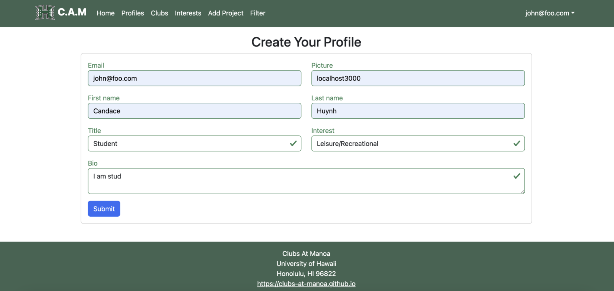

# Club Hub

[Clubs At Manoa GitHub Organization](https://github.com/Clubs-At-Manoa)

## Table of contents

* [Overview](#overview)
* [Approach](#approach)
* [Use Case Ideas](#use-case-ideas)
* [Beyond The Basics](#beyond-the-basics)
* [Deployment](#deployment)
* [Milestone1](#milestone-1-mockup-development)
* [Mockups](#mockups)
* [Milestone2](#milestone-2-functional-development)
* [Milestone3](#milestone-3-final-project)
* [UserGuide](#userguide)
* [DeveloperGuide](#developer-guide-)
* [TeamContract](#team-contract)

## Overview

The problem: UH Manoa has over 200 Registered Independent Organizations, plus many more that do not have this “official” status but are nonetheless active organizations. Unfortunately, there is no easy way for students to learn (a) what student clubs (both registered and unregistered) exist, what they do, and how to get further involved.

The solution: The Club Hub application will provide a centralized directory for UH Manoa student clubs. UH Manoa students can login to browse a well organized directory of all current student clubs, with brief descriptions, meeting times and locations, URLs to their websites (if any), contact information for officers, and a few select photos.

* Three primary collections (Profiles, Projects, Interests) as well as three "join" Collections (ProfilesInterests, ProfilesProjects, and ProjectsInterests) that implement many-to-many relationships between them.
* Top-level index pages (Profiles, Interests, and Projects) that show how to manipulate these six collections in various ways.
* Initialization code to define default Profiles, Interests, and Projects and relations between them.
* A simple Filter page to illustrate how to perform simple queries on the database and display the results.
* Use of Meteor Methods to illustrate how to simplify implementation of multiple collection updates.
* Use of indexes to enforce uniqueness of certain fields in the collections, enabling them to serve as primary keys.
* Authentication using the built-in Meteor accounts package along with Sign Up and Sign In pages.
* Authorization examples: certain pages are public (Profiles, Projects, Interests), while other pages require login (AddProject, Filter).
* Use of Meteor Assets to initialize the database (helpful when initialization exceeds settings file size limits).

### Approach

Club Hub has three user roles, all of whom login with their UH ID. Regular users browse the directory. Club Admins have the ability to edit the data associated with their club. Super Admins make sure site content is appropriate and grant “club admin” privileges to selected users.

The site should not simply support browsing by a list of clubs in alphabetical order, but should also allow filtering by interest area. For example, “athletic” clubs, “art” clubs, “music” clubs, etc. A club can belong to multiple interest areas.

Users can specify interest areas, and be notified when a new club is created matching that interest area (or an existing club adds that interest area).

Admins can monitor the site for inappropriate content, and create new categories of musical tastes, capabilities, and goals.

Note: if you choose this idea for your final project, you cannot name it “Club Hub”. Come up with a different name for your final project.

Some possible mockup pages include:

* Landing Page
* User home page
* Admin home page
* Club admin home page
* Browse clubs by interest area(s)

### Use case ideas

Whether the following bullet points list all pages or not, the completed use case should show an end-to-end scenario of using the system.

* New user goes to landing page, logs in, gets home page, sets up profile. (How do they learn how system works?)
* Admin goes to landing page, logs in, gets home page, edits site.
* User goes to landing page, logs in, looks for clubs of interest.
* Club admin goes into site, updates their club profile.

### Beyond the basics

After implementing the basic functionality, here are ideas for more advanced features:

* Upload club data from the CSV version of the RIO spreadsheet.
* Notify admins when club data changes, so they can review for appropriateness.
* Provide “expiration date” for club listings (either one semester or one academic year). To retain a listing, the club admin or admin must login and click a “renew” button for the club to re-list it in the site.
* Allow students to rate clubs.

### Deployment

[Clubs At Manoa deployed application via Digital Ocean](https://clubs-at-manoa.xyz/)

### Milestone 1: Mockup development

The goal for Milestone 1 is to get our project up and running.

Our TODOs include:

* Add a link to our Team Contract
* Deploying our system to digital ocean
* Create a landing page
* Create a login area on the landing page
* Create a mockup for the user home page
* Create a mockup for the admin home page
* Create a mockup for the club admin home page
* Create a mockup of page to browse clubs by interest area(s)

Milestone 1 was managed using [Clubs At Manoa GitHub Project Board M1](https://github.com/orgs/Clubs-At-Manoa/projects/2/views/1)

### Mockups
<div class="text-center p-4">
  
  
  
  
  
  
  
  
</div>


### Milestone 2: Functional development

Our TODOs include:
* Significantly improve the functionality and quality of application beyond M1.
* Significantly improve software engineering process beyond M1.
* Four pages in addition to the Landing page should be available in the deployment.
* At least one page in the deployment should read data from the database (i.e. from MiniMongo).
* At least one page in the deployment should write data to the database (i.e. using a form).

Milestone 2 was managed using [Clubs At Manoa GitHub Project Board M2](https://github.com/orgs/Clubs-At-Manoa/projects/3/views/1)

### Milestone 3: Final project

Our TODOs include: 
* Significantly improve the functionality of your system from Milestone M2.
* Incorporate a significant amount of “real” data into your system. 
* Find at least five UH community members (not from ICS 314) to try out your system and provide feedback.
* Implement acceptance testing

Milestone 3 was managed using [Clubs At Manoa GitHub Project Board M3](https://github.com/orgs/Clubs-At-Manoa/projects/4)

### User Guide

This section provides a walkthrough of the Clubs At Manoa user interface and its capabilities.

#### Landing Page

The landing page is presented to users when they visit the top-level URL to the site.


#### Index pages (Clubs, Profiles, Interests)

Clubs At Manoa provides two public pages that present the contents of the database organized in different ways.

The Clubs page shows all the current defined Clubs, their information, and associated Interest:


Interests page shows all the currently defined Clubs by their Club Types, and their associated Profiles:


#### Sign in and sign up

Click on the “Login” button in the upper right corner of the navbar, then select “Sign in” to go to the following page and login. You must have been previously registered with the system to use this option:


Alternatively, you can select “Sign up” to go to the following page and register as a new user:


#### Home page
After logging in, you are taken to the home page, which presents a form where you can complete and/or update your personal profile.




#### Profiles page

The Profiles page shows all the current defined profiles and their associated Clubs.

#### Filter page
The Filter page provides the ability to query the database and display the results in the page. In this case, the query displays all of the Clubs that match one or more of the specified Interest(s).

### Developer Guide 

This section provides information of interest to Meteor developers wishing to use this code base as a basis for their own development tasks.

#### Installation
First, [install Meteor](https://docs.meteor.com/install.html).

Second, visit the [Clubs At Manoa application github page](https://github.com/Clubs-At-Manoa), and click the “Use this template” button to create your own repository initialized with a copy of this application. Alternatively, you can download the sources as a zip file or make a fork of the repo. However you do it, download a copy of the repo to your local computer.

Third, cd into the clubs-at-manoa/app directory and install libraries with:

```
$ meteor npm install
```

Fourth, run the system with:

```
$ meteor npm run start
```

If all goes well, the application will appear at [http://localhost:3000](http://localhost:3000/).

#### Application Design

Bowfolios is based upon [meteor-application-template-react](https://ics-software-engineering.github.io/meteor-application-template-react/) and [meteor-example-form-react](https://ics-software-engineering.github.io/meteor-example-form-react/). 

#### Data Model

The Clubs At Manoa data model consists of three “primary” collections (Clubs, Profiles, and Interests), as well as one “join” Collections (ClubsInterests). To understand this design choice, consider the situation where you want to specify the Clubs associated with a Profile.

Design choice: Provide a “join” collection where each document contains two fields: Profile name and Club name. Each entry indicates that there is a relationship between those two entities. Now, to find all the Projects associated with a Profile, just search this collection for all the documents that match the Profile, then extract the Club field. Going the other way is just as easy: to find all the Profiles associated with a Club, just search the collection for all documents matching the Club, then extract the Profile field. 

Club At Manoa implements a Design choice to provide pair-wise relations between all three of its primary collections:


#### Initialization
The [config](https://github.com/Clubs-At-Manoa/clubs-at-manoa.github.io/tree/main/config) directory is intended to hold settings files. The repository contains one file: [config/settings.development.json](https://github.com/Clubs-At-Manoa/clubs-at-manoa.github.io/blob/main/config/settings.development.json).

This file contains default definitions for Profiles, Clubs, and Interests and the relationships between them.

The settings.development.json file contains a field called “loadAssetsFile”. It is set to false, but if you change it to true, then the data in the file app/private/data.json will also be loaded. The code to do this illustrates how to initialize a system when the initial data exceeds the size limitations for the settings file.

#### Quality Assurance

##### ESLint
Clubs At Manoa includes a [.eslintrc](https://github.com/Clubs-At-Manoa/clubs-at-manoa.github.io/blob/main/app/.eslintrc.js) file to define the coding style adhered to in this application. You can invoke ESLint from the command line as follows:

```
meteor npm run lint
```

Here is sample output indicating that no ESLint errors were detected:
```
$ meteor npm run lint

> clubs-at-manoa@ lint /Users/johnfoo/github/clubs-at-manoa/clubs-at-manoa/app
> eslint --quiet --ext .jsx --ext .js ./imports ./tests

$
```
ESLint should run without generating any errors.

It’s significantly easier to do development with ESLint integrated directly into your IDE (such as IntelliJ).

##### End to End Testing
Clubs At Manoa uses TestCafe to provide automated end-to-end testing.

### Team Contract
Team Contract Link [Clubs At Manoa Team Contract](https://docs.google.com/document/d/12P4cILMMUF1ZTil_tapX8uh4npj-fnaBoBRHeb4GNOQ/edit#heading=h.ttlepxesoam)
